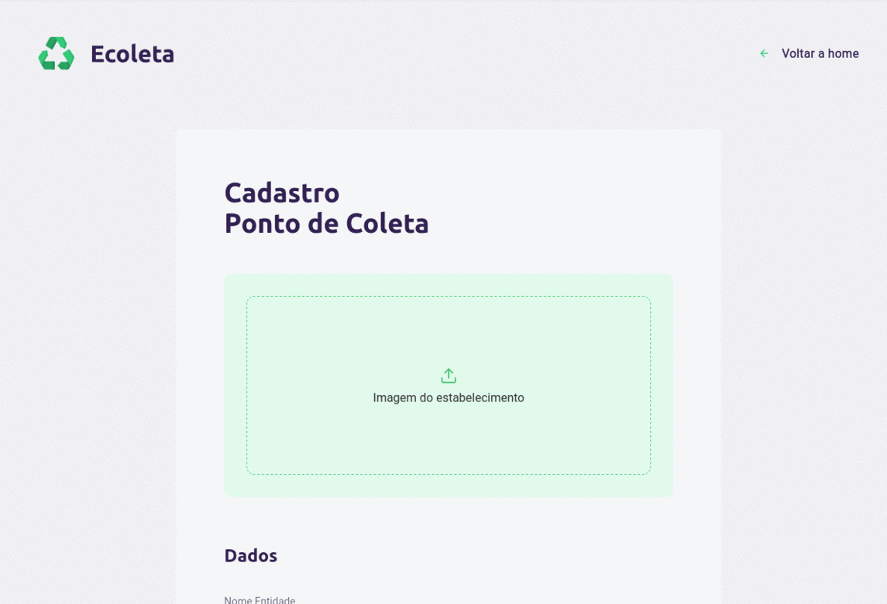
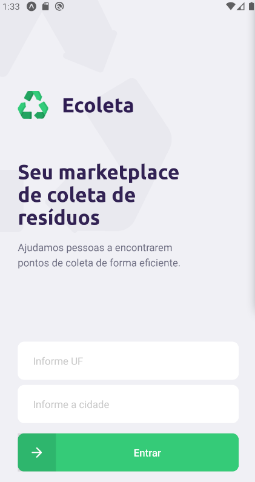
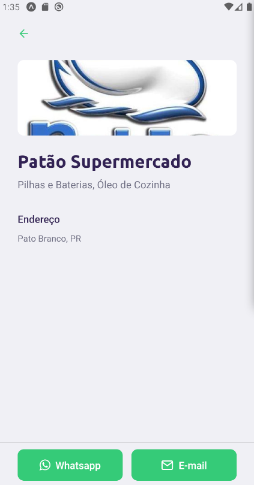

## :bookmark: Sobre

O <strong>Ecoleta</strong> é uma aplicação Web e Mobile para ajudar pessoas a encontrarem pontos de coleta para reciclagem.

Essa aplicação foi construída na trilha <strong>Booster</strong> da <strong>Next Level Week</strong> distribuída pela [Rocketseat](https://rocketseat.com.br/). A ideia de criar uma aplicação voltada ao meio ambiente surgiu da coincidência da data do curso e a data da <strong>semana do meio ambiente</strong>.

## :rocket: Tecnologias Utilizadas

O projeto foi desenvolvido utilizando as seguintes tecnologias

- [TypeScript](https://www.typescriptlang.org/)
- [Node.js](https://nodejs.org/en/)
- [ReactJS](https://reactjs.org/)
- [React Native](https://reactnative.dev/)

## :computer: Versão Web

<h1 align="center">
    
</h1>

<h1 align="center">
    
</h1>


## :iphone: Resultado Mobile

<h1 align="center">
    
    
    
</h1>


## 👨🏻‍💻 Como usar

- ### **Pré-requisitos**

  - É **necessário** possuir o **[Node.js](https://nodejs.org/en/)** instalado na máquina
  - Também, é **preciso** ter um gerenciador de pacotes **[Yarn](https://yarnpkg.com/)**.
  - Por fim, é **essencial** ter o **[Expo](https://expo.io/)** instalado de forma global na máquina

1. Faça um clone :

```sh
  $ git clone https://github.com/henriquemanduca/ecoleta.git
```

2. Executando a Aplicação:

```sh
  # Instale as dependências
  $ yarn install

  ## Crie o banco de dados
  $ cd server
  $ yarn run knex:migrate
  $ yarn run knex:seed

  # Inicie a API
  $ yarn run dev

  # Inicie a aplicação web
  $ cd web
  $ yarn start

  # Inicie a aplicação mobile
  $ cd mobile
  $ yarn start
```

## :mortar_board: Quem ministrou?

As aulas foram ministradas pelo mestre **[Diego Fernandes](https://github.com/diego3g)** nas aulas da **Next Level Week**.

## :memo: License

Esse projeto está sob a licença MIT. Veja o arquivo [LICENSE](LICENSE.md) para mais detalhes.

